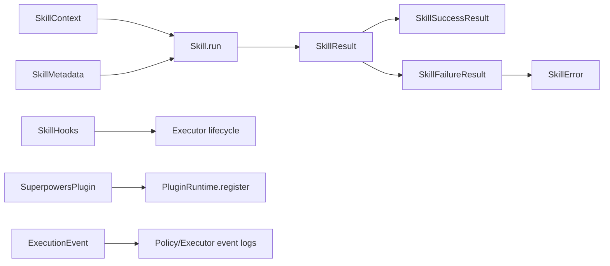

# 模块 01：类型系统精读（`src/types.ts`）

## 模块定位

这个文件定义了整个内核的“协议层”。  
后面的 Registry / Router / Executor / Plugin 都在依赖这些类型约定。

## 模块流程图

## 逐行精读（`src/types.ts`）

1. 定义 `SkillContext` 接口，作为 skill 运行时输入容器。  
2. `input: string` 表示用户原始输入文本。  
3. `metadata?` 是可选扩展信息，便于后续加上下文。  
4. 结束 `SkillContext` 定义。  
5. 空行，分隔类型块。  
6. 定义 `SkillMetadata`，用于技能元信息。  
7. `version` 明确技能版本。  
8. `tags` 支持分类与检索。  
9. 结束 `SkillMetadata`。  
10. 空行。  
11. 定义联合字面量 `SkillErrorCode`，只允许 3 类错误。  
12. 空行。  
13. 定义 `SkillError` 结构。  
14. `code` 使用前面的受限错误码。  
15. `message` 是可读错误信息。  
16. 结束 `SkillError`。  
17. 空行。  
18. 定义成功结果 `SkillSuccessResult`。  
19. `ok: true` 作为判别字段（discriminated union）。  
20. `output` 返回文本输出。  
21. 结束成功结构。  
22. 空行。  
23. 定义失败结果 `SkillFailureResult`。  
24. `ok: false` 对应失败分支。  
25. `output` 仍保留输出，方便统一展示。  
26. `error` 挂载结构化错误对象。  
27. 结束失败结构。  
28. 空行。  
29. 用联合类型 `SkillResult` 把成功/失败统一为单返回类型。  
30. 空行。  
31. 定义 `Skill` 核心接口。  
32. `name` 是技能唯一标识（由 registry 校验）。  
33. `description` 是 CLI 展示信息。  
34. `metadata` 是版本与标签。  
35. `run` 是技能执行函数，异步返回 `SkillResult`。  
36. 结束 `Skill`。  
37. 空行。  
38. 定义 `HookContext`，hooks 共用上下文。  
39. `input` 记录当次输入。  
40. `skillName` 记录当前技能名。  
41. 结束 `HookContext`。  
42. 空行。  
43. 定义 `SkillHooks` 接口（生命周期钩子）。  
44. `beforeRun` 在执行前触发，可异步。  
45. `afterRun` 在执行后触发，拿到最终结果。  
46. `onError` 错误时触发，拿到结构化错误。  
47. 结束 `SkillHooks`。  
48. 空行。  
49. 定义 `SuperpowersPlugin`，插件最小协议。  
50. `name` 为插件来源标识。  
51. `skills` 是该插件提供的技能列表。  
52. `hooks?` 可选注入生命周期钩子。  
53. 结束插件定义。  
54. 空行。  
55. 定义 `ExecutionEvent` 统一事件结构。  
56. `type` 是事件类型字符串。  
57. `timestamp` 是 ISO 时间戳。  
58. `details?` 可选携带附加信息。  
59. 结束 `ExecutionEvent`。  

## 学习检查点

- 为什么 `SkillResult` 要用 `ok` 判别联合？
- 为什么 hooks 不直接抛错而是透传 `SkillError`？
- 如果你要加 `timeout-error`，最小修改路径是什么？
