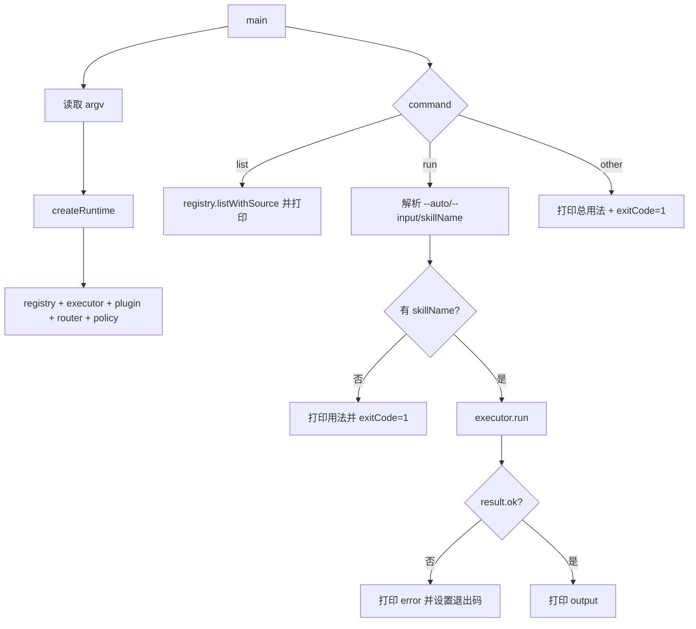

# 模块 06：插件与 CLI 精读（`src/core/plugin.ts` + `src/cli.ts`）

## 模块职责

- `PluginRuntime`：统一注册插件技能和插件 hooks；
- `CLI`：创建运行时、解析参数、执行命令。

## 模块流程图（PluginRuntime）

```mermaid
flowchart TD
  A[register(plugin)] --> B[registry.registerMany(plugin.skills, plugin.name)]
  B --> C{plugin.hooks 存在?}
  C -- 是 --> D[executor.addHooks(plugin.hooks)]
  C -- 否 --> E[结束]
  D --> E
```

## 逐行精读（`src/core/plugin.ts`）

1. 导入 `SuperpowersPlugin` 类型。  
2. 导入 `SkillExecutor`。  
3. 导入 `InMemorySkillRegistry`。  
4. 空行。  
5. 定义 `PluginRuntime`。  
6. 构造函数开始。  
7. 注入 registry。  
8. 注入 executor。  
9. 结束构造函数参数。  
10. 空行。  
11. `register` 方法。  
12. 把插件技能批量注册，来源名就是插件名。  
13. 判断插件是否带 hooks。  
14. 有 hooks 则注入 executor。  
15. 结束 if。  
16. 结束 `register`。  
17. 结束类。  

## 模块流程图（CLI 主链路）



## 逐行精读（`src/cli.ts`）

1. Shebang，支持命令行直接执行。  
2. 导入 Registry。  
3. 导入 Executor。  
4. 导入 PluginRuntime。  
5. 导入 Policy。  
6. 导入 Router。  
7. 导入示例技能与插件。  
8. 空行。  
9. 定义 `createRuntime`。  
10. 返回值类型约束。  
11. 暴露 registry。  
12. 暴露 executor。  
13. 暴露 policy。  
14. 进入函数体。  
15. 创建 registry。  
16. 注册 core skills。  
17. 创建 executor。  
18. 创建插件运行时。  
19. 注册 planning 插件。  
20. 空行。  
21. 创建 router。  
22. 创建 policy，并传关键词映射。  
23. `plan` 关键词映射 `plan` 技能。  
24. `workflow` 关键词映射 `workflow` 技能。  
25. `hello` 关键词映射 `hello` 技能。  
26. 结束映射对象。  
27. 结束 policy 初始化。  
28. 空行。  
29. 返回 runtime 组件。  
30. 结束 `createRuntime`。  
31. 空行。  
32. 定义 `readOption` 读取 `--input` 这类带值参数。  
33. 找参数名位置。  
34. 未找到或无后继值则返回 undefined。  
35. 结束判断。  
36. 返回参数值。  
37. 结束函数。  
38. 空行。  
39. 定义 `hasOption` 判断布尔开关参数。  
40. 使用 `includes` 判断。  
41. 结束函数。  
42. 空行。  
43. 定义 `readRunSkillName`，从 run 子命令参数提取技能名。  
44. 遍历参数。  
45. 读取当前参数。  
46. 如果遇到 `--input`。  
47. 跳过其值位。  
48. 继续循环。  
49. 结束分支。  
50. 空行。  
51. 找到第一个非 `--` 前缀参数即当作 skillName。  
52. 返回该参数。  
53. 结束分支。  
54. 结束循环。  
55. 空行。  
56. 未找到技能名则返回 undefined。  
57. 结束函数。  
58. 空行。  
59. `main` 异步入口。  
60. 读取命令参数（去掉 node 与脚本名）。  
61. 第一个参数作为 command。  
62. 空行。  
63. 创建运行时。  
64. 空行。  
65. 处理 `list` 命令。  
66. 遍历 `listWithSource`。  
67. 打印 tab 分隔输出。  
68. 输出字段：name / description / version / tags / source。  
69. 结束打印。  
70. 结束循环。  
71. list 分支直接返回。  
72. 结束 list 分支。  
73. 空行。  
74. 处理 `run` 命令。  
75. 取 run 子参数。  
76. 读取 `--auto` 开关。  
77. 读取 `--input`。  
78. auto 模式走 policy；否则按显式技能名。  
79. 空行。  
80. 如果没有技能名。  
81. 打印错误信息。  
82. auto 模式提示输入更丰富。  
83. 非 auto 模式提示用法。  
84. 字符串结束。  
85. 结束打印。  
86. 设退出码 1。  
87. 返回。  
88. 结束无技能名分支。  
89. 空行。  
90. 调用 executor 执行。  
91. 空行。  
92. 执行失败分支。  
93. 打印 `[code] message`。  
94. `invalid-input` 退出码 2，其余 1。  
95. 返回。  
96. 结束失败分支。  
97. 空行。  
98. 成功则打印输出。  
99. 返回。  
100. 结束 run 分支。  
101. 空行。  
102. 其它命令统一打印用法。  
103. 设置退出码 1。  
104. 结束 main。  
105. 空行。  
106. 兜底捕获 main 未处理异常。  
107. 打印异常。  
108. 退出码 1。  
109. 结束 catch。  
110. 文件结束。  

## 学习检查点

- 为什么 `createRuntime` 把装配逻辑集中在一起？
- `run --auto` 和 `run <skill>` 在职责上如何区分？
- CLI 的退出码设计对自动化脚本有什么意义？
