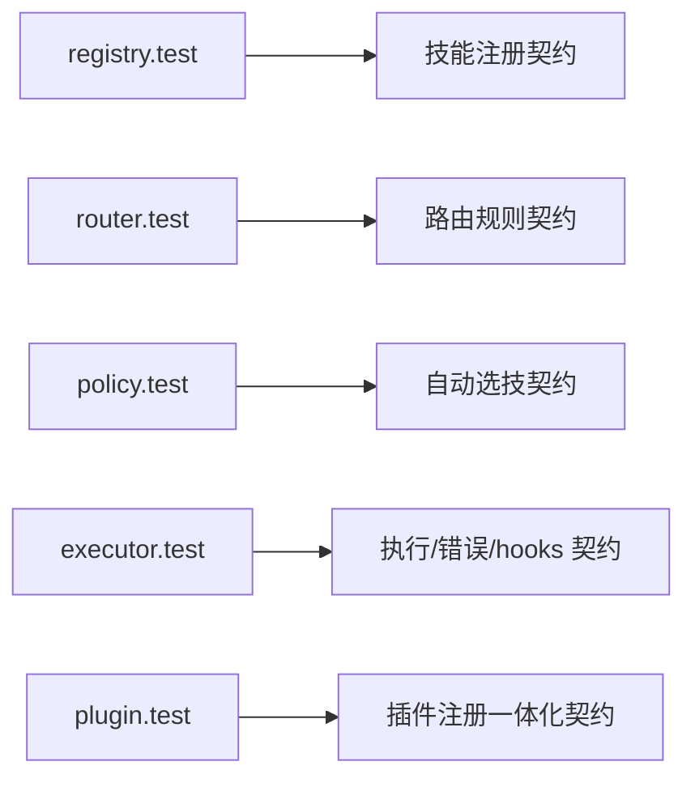

# 模块 07：测试与行为契约精读（`test/*.test.ts`）

## 为什么必须学测试

源码告诉你“怎么实现”，测试告诉你“必须保持什么行为不变”。  
要深入理解仓库，测试必须和源码一起读。

## 模块流程图

## 逐文件精读

## 1) `test/registry.test.ts`

- 覆盖点：
  - 注册后可查询；
  - list 必须按名字排序；
  - 重复名抛错；
  - 非法名抛错；
  - 来源追踪正确。
- 价值：锁定 Registry 的输入约束和展示顺序。

## 2) `test/router.test.ts`

- 覆盖点：
  - 默认规则优先级：exact > contains；
  - 支持自定义规则链替换默认行为。
- 价值：保证 Router 的可扩展性和可预测性。

## 3) `test/policy.test.ts`

- 覆盖点：
  - 关键词命中优先于 Router；
  - 关键词未命中时回退 Router；
  - 全部未命中时返回 undefined 并记录 `policy.no-match`。
- 价值：锁定 auto 模式选技语义。

## 4) `test/executor.test.ts`

- 覆盖点：
  - not-found 错误包装；
  - 正常技能执行；
  - 空技能名 invalid-input；
  - hooks 前后顺序与事件记录；
  - 运行时异常映射为 runtime-error + onError 触发。
- 价值：这是执行语义的主契约。

## 5) `test/plugin.test.ts`

- 覆盖点：
  - 插件一次注册同时完成 skill 注入与 hooks 注入。
- 价值：验证 PluginRuntime 的“单入口整合”职责。

## 阅读顺序建议

1. 先读 `registry + router` 测试（基础能力）；
2. 再读 `policy`（自动策略）；
3. 再读 `executor`（核心运行时）；
4. 最后读 `plugin`（扩展机制）。

## 学习检查点

- 如果你改了错误码，哪些测试会先失败？
- 如果你改了路由规则顺序，哪些测试会失败？
- 为什么说测试是“模块接口说明书”而不只是“回归工具”？
